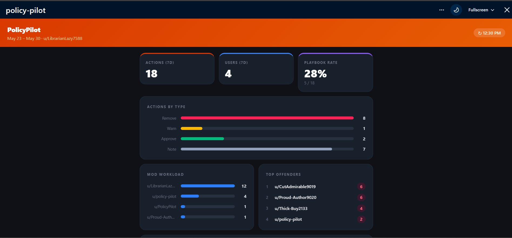
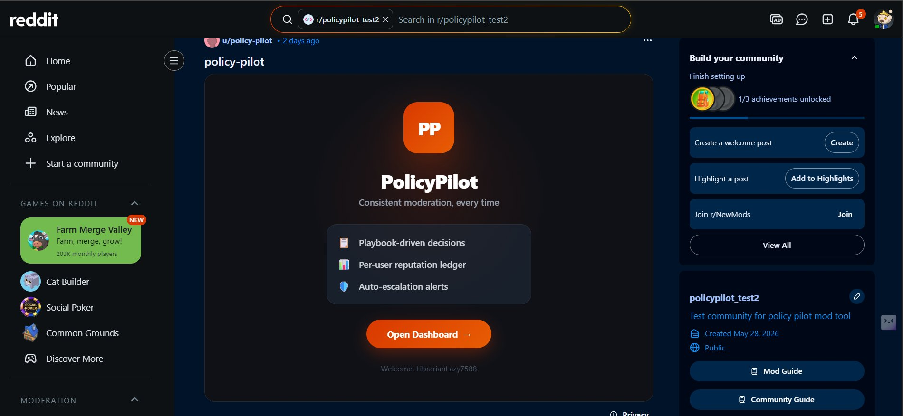
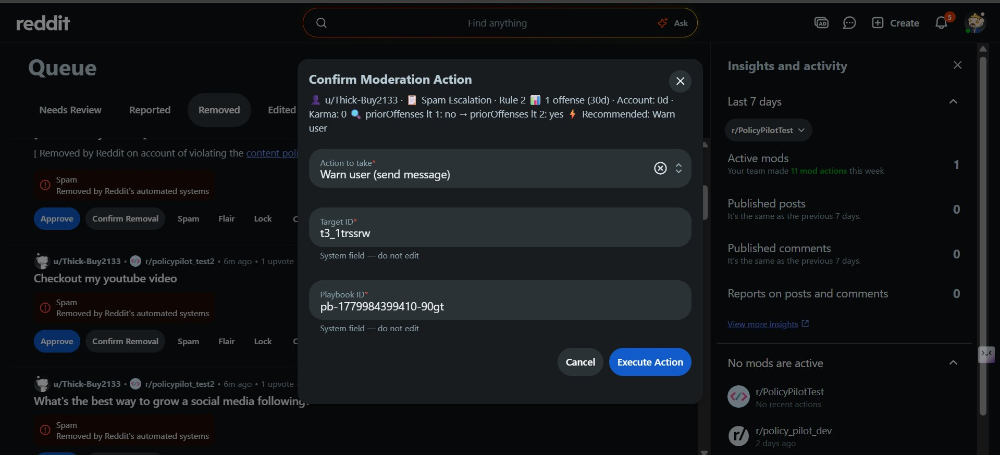
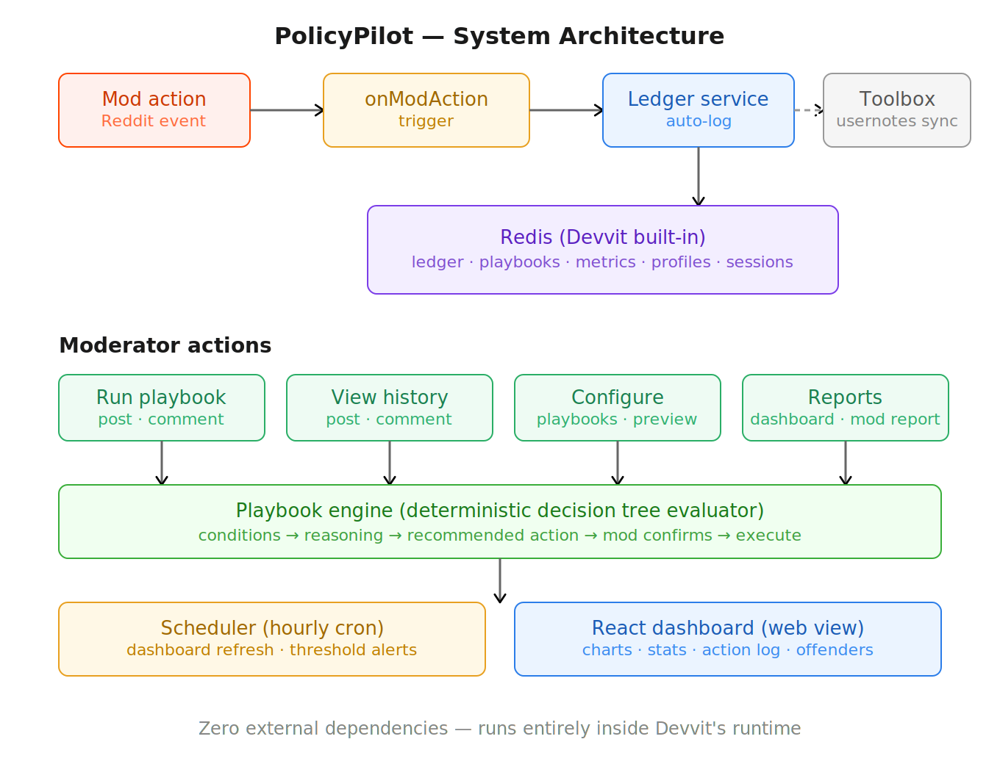

# PolicyPilot

<p align="center">
  
</p>

<p align="center">
  <strong>Decision governance for Reddit moderators.</strong>
</p>

<p align="center">
  <em>AutoMod decides what to catch. PolicyPilot decides what to do about it.</em>
</p>

<p align="center">
  <a href="https://devpost.com/software/policypilot-decision-governance-for-reddit-moderators">Devpost</a> •
  <a href="https://developers.reddit.com/apps/policy-pilot">App Directory</a> •
  <a href="YOUR_YOUTUBE_URL">Demo Video</a>
</p>

Built for the **Reddit Mod Tools & Migrated Apps Hackathon 2026**.

---

## The Problem

AutoMod is stateless — it treats every interaction as the first. PolicyPilot adds **memory**, **consistency**, and **visibility** to Reddit moderation:

- Every mod action is automatically logged to a per-user reputation ledger
- Playbooks walk mods through the correct escalation tier based on user history
- A live dashboard surfaces top offenders before they become a problem
- The same recommendation surfaces for every mod on the team — no inconsistency

**No AI. No external APIs. 100% deterministic** — pure logic running on Devvit's infrastructure with Redis storage.

---

## Screenshots

<p align="center">
  
</p>

<p align="center">
  
</p>

---

## What It Does

| Feature | Description |
|---|---|
| **Reputation Ledger** | Every mod action (remove, warn, tempban, permban, approve) is automatically logged per user with timestamps, rule IDs, and playbook usage flags |
| **Playbook Engine** | Senior mods define decision trees — if Rule X + account age + prior offenses → action. Any mod runs the playbook and gets walked through the correct step |
| **Risk Badge** | 🟢🟡🔴 instant toast on any post/comment showing user risk level + account age + karma |
| **View User History** | Context menu on any post/comment → see full action log with per-rule offense breakdown |
| **Run Playbook** | Context menu on any post/comment → select a playbook → follow step-by-step guided moderation |
| **Configure Playbooks** | Build playbooks tied to subreddit rules with 3-tier escalation, new-account gates, and removal reason templates |
| **Preview Playbook** | Dry-run simulation against the last 15 actioned users — zero side effects |
| **Manage Playbooks** | List, review, and delete existing playbooks with confirmation |
| **Distinguished Removal Comments** | When a playbook removes content, an explanatory mod comment is posted automatically |
| **Dynamic Rule Names** | Fetches actual subreddit rules via `reddit.getRules()` — works on any subreddit, not just our test sub |
| **Generate Mod Report** | One-click report posted to the subreddit with 7-day team stats, top offenders, and playbook usage |
| **Ops Dashboard** | Mod-only custom post showing team metrics, offenders approaching thresholds, mod workload, and playbook consistency score |
| **Auto-Escalation Alerts** | Hourly scheduler checks offender thresholds and sends modmail alerts automatically |
| **Toolbox Integration** | Syncs ledger entries as Mod Toolbox usernotes — works alongside existing Toolbox installs |

---

## Architecture

<p align="center">
  
</p>

Triggers fire automatically on every mod action — no extra steps for the mod team. The ledger is the single source of truth that all other features read from.

---

## Menu Items

All menu items appear in the right-click context menu (moderators only).

| Menu Item | Where | Description |
|---|---|---|
| View User History | Post / Comment | Quick risk check toast + full action log form |
| Run Playbook | Post / Comment | Step-by-step guided moderation flow |
| Configure Playbooks | Subreddit | Create new playbooks tied to subreddit rules |
| Preview Playbook | Subreddit | Dry-run simulation against recent users |
| Manage Playbooks | Subreddit | List, review, and delete existing playbooks |
| Create Dashboard Post | Subreddit | Creates the ops dashboard custom post |
| Generate Mod Report | Subreddit | Post a 7-day activity report to the subreddit |

---

## App Settings

Configurable per subreddit in the Devvit App Settings panel:

| Setting | Default | Description |
|---|---|---|
| Auto-escalation enabled | `true` | Whether the threshold checker sends modmail alerts |
| Warnings before temp ban | `3` | Soft action count that triggers a warn-level modmail alert |
| Temp bans before perm ban | `2` | Temp ban count that triggers a tempban-level alert |
| Time window (days) | `30` | Rolling window for offense counting and threshold checks |

---

## Redis Schema

All keys are automatically namespaced per subreddit by Devvit's Redis runtime.

| Key | Type | Purpose |
|---|---|---|
| `ledger:{userId}` | Sorted Set (score = timestamp) | Per-user moderation history |
| `ledger:users` | Sorted Set (score = timestamp) | Index of all users with ledger entries |
| `playbook:{playbookId}` | String (JSON) | Playbook definition with decision tree |
| `playbooks:index` | Hash | Index of all playbook IDs → names |
| `metrics:daily:{YYYY-MM-DD}` | String (JSON) | Pre-computed daily dashboard metrics |
| `profile:{userId}` | String (JSON, TTL 1 hr) | Cached public user profile data |
| `config:dashPostId` | String | ID of the dashboard custom post |
| `dashboard:lastRefresh` | String | Timestamp of last dashboard refresh |
| `alert:threshold:{userId}` | String (TTL = time window) | Deduplication key for escalation alerts |
| `pb-dedup:{targetId}` | String (TTL 30s) | Set by playbook before executing, checked by trigger to prevent double-counting |
| `session:pb:{modId}:{targetId}` | String (JSON, TTL 15 min) | In-progress playbook session state |

---

## Tech Stack

- **[Devvit](https://developers.reddit.com/) `@devvit/web` v0.12.24** — Reddit Developer Platform runtime
- **[Hono](https://hono.dev/)** — Server routing
- **[React](https://react.dev/)** — Dashboard web view UI
- **[Tailwind CSS 4](https://tailwindcss.com/)** — Styles
- **[Vite](https://vite.dev/)** — Client bundler
- **TypeScript** — End-to-end type safety
- **[toolbox-devvit](https://www.npmjs.com/package/toolbox-devvit) 0.4.0** — Optional Toolbox usernote sync

---

## Development

> Requires Node 22.

```bash
# Install dependencies
npm install

# Start live playtest on your test subreddit
npx devvit playtest <subreddit-name>

# Build client and server
npm run build

# Upload a new version (private, only you can install)
npx devvit upload

# Publish publicly to the App Directory
npx devvit publish

# Type-check
npm run type-check

# Stream live logs from your installed app
npx devvit logs <subreddit-name>
```

### Testing Flow

1. Install the app on your test subreddit via `devvit playtest`
2. Configure subreddit Safety Filters → set Reputation filter to Off (for testing with new accounts)
3. Create a test post with a second account
4. Remove it as a mod → `onModAction` trigger fires → entry logged to ledger
5. Right-click any post by that user → **View User History** → verify offense count and risk badge
6. Right-click subreddit menu → **Configure Playbooks** → create a 3-tier playbook for Rule 1
7. Right-click a flagged post → **Run Playbook** → follow the guided flow → confirm action
8. Repeat 2-3 more times to demonstrate Tier 1 → Tier 2 → Tier 3 escalation
9. Right-click subreddit menu → **Create Dashboard Post** → verify metrics render
10. Right-click subreddit menu → **Generate Mod Report** → verify the report post

---

## Design Principles

1. **Fully deterministic** — No AI, no external calls. Pure logic on Devvit's infrastructure.
2. **Community sovereignty** — All data stays local to the subreddit. No cross-community data.
3. **Complement, don't replace** — Works alongside AutoMod. AutoMod catches violations; PolicyPilot decides the response.
4. **Speed over cleverness** — Every interaction is sub-second. Cache aggressively, compute lazily.
5. **Human in the loop** — PolicyPilot walks mods through decisions but never acts autonomously.
6. **Dedup-safe triggers** — Playbook-executed actions set a short-lived Redis key so the trigger skips duplicate ledger entries.

---

## Project Structure

```
src/
├── server/
│   ├── index.ts                 # Hono app entry, wires routes
│   ├── routes/
│   │   ├── api.ts               # GET /dashboard, /init
│   │   ├── menu.ts              # Menu item routes
│   │   ├── forms.ts             # Form submission routes
│   │   └── triggers.ts          # Trigger event routes
│   ├── menuItems/
│   │   ├── runPlaybook.ts
│   │   ├── viewHistory.ts
│   │   ├── configPlaybook.ts
│   │   └── modReport.ts
│   ├── scheduler/
│   │   ├── dashboardRefresh.ts
│   │   └── thresholdChecker.ts
│   ├── triggers/
│   │   └── onModAction.ts
│   ├── services/
│   │   ├── ledgerService.ts
│   │   ├── playbookService.ts
│   │   ├── metricsService.ts
│   │   └── profileService.ts
│   └── utils/
│       └── redisKeys.ts
├── client/
│   ├── splash.tsx               # Custom post splash view
│   ├── pages/
│   │   └── Dashboard.tsx        # React dashboard web view
│   └── index.css
└── shared/
    ├── types.ts
    └── api.ts
```

---

## License

BSD-3-Clause
